# Active Directory Home Lab

## 📌 Overview
This project demonstrates the deployment and administration of a Windows Active Directory environment in a virtualized lab.

The lab simulates common tasks performed by IT Support and System Administration professionals, including configuring a domain controller, creating and managing users, joining client computers to a domain, configuring Group Policy, managing account lockouts, setting file permissions, and enabling Remote Desktop access.

The purpose of this project was to gain hands-on experience with enterprise Windows environments and common IT administration tasks.

---

## 🛠️ Technologies Used

- Windows Server
- Windows 10
- Active Directory Domain Services (AD DS)
- Microsoft Azure
- PowerShell
- Group Policy
- DNS
- Remote Desktop Protocol (RDP)

---

## 🧪 Lab Environment

The environment consists of:

- **Domain Controller (DC-1)** — Windows Server
- **Client Computer (Client-1)** — Windows 10
- **Active Directory Domain**
- Microsoft Azure virtual machines
- Private virtual network

DC-1 provides Active Directory Domain Services and DNS services for the environment, while Client-1 is joined to the domain and used to simulate an employee workstation.

---

## 🎯 Project Objectives

During this project, I performed the following tasks:

- Deployed Windows Server and Windows 10 virtual machines
- Installed Active Directory Domain Services
- Promoted Windows Server to a Domain Controller
- Created and configured an Active Directory domain
- Created Organizational Units (OUs)
- Created and managed domain users
- Joined a Windows client computer to the domain
- Configured Remote Desktop access for domain users
- Created and tested Group Policy settings
- Configured an account lockout policy
- Managed user account lockouts
- Created network file shares
- Configured NTFS and share permissions
- Used PowerShell for Active Directory administration
- Practiced troubleshooting common user and access issues

---

## 📚 Lab Documentation

### 1. Domain Controller & Network Setup

I created the foundational Azure infrastructure for the Active Directory environment by deploying two virtual machines on the same private virtual network:

- **DC-1:** Windows Server 2022 virtual machine used as the Domain Controller
- **Client-1:** Windows 10 Pro virtual machine used as the domain client

#### Azure Network Configuration

I created a Resource Group and Virtual Network (VNet) in Microsoft Azure to keep the lab resources organized and allow DC-1 and Client-1 to communicate over the same private network.
#### Azure Virtual Machine Environment

The lab environment was deployed in Microsoft Azure using two virtual machines on the same virtual network.

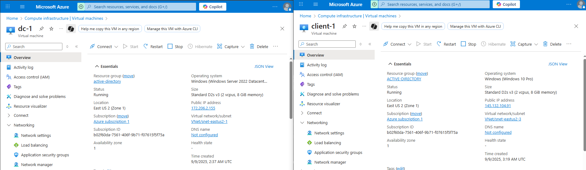
#### Domain Controller Configuration

I deployed DC-1 using Windows Server 2022 and configured its private IP address as static.

Using a static private IP is important for a Domain Controller because client devices rely on the Domain Controller for services such as DNS and authentication. If the Domain Controller's IP address changed, clients could lose connectivity to these services.

#### Client Configuration

I deployed Client-1 using Windows 10 Pro within the same Resource Group and Virtual Network as DC-1.

I then configured Client-1's DNS settings to use the private IP address of DC-1 as its DNS server. This allows the client to locate the Domain Controller and prepares the machine to join the Active Directory domain.

After applying the DNS configuration and restarting Client-1, I connected to the client through Remote Desktop and verified network connectivity with DC-1.

#### Network Connectivity Verification

I verified Client-1's network configuration using `ipconfig /all` and tested connectivity to DC-1 using `ping`.

The successful ping test confirmed communication between the client and Domain Controller with 0% packet loss.

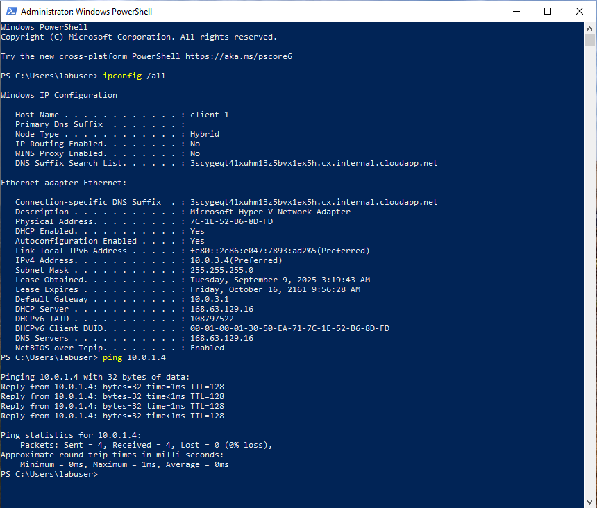

I used tools such as:

- `ping`
- `ipconfig`
- PowerShell

Successful communication between the two machines confirmed that the virtual network and DNS configuration were functioning correctly.

### 2. Active Directory Deployment & Domain Join

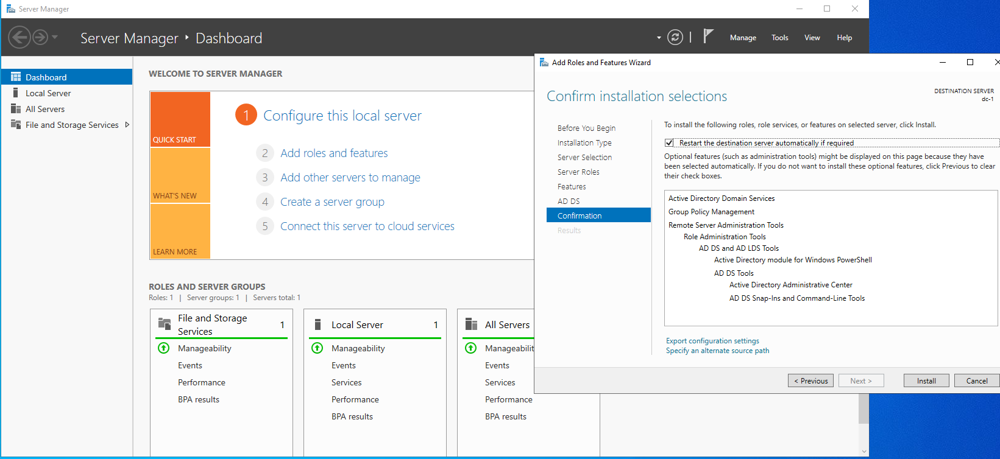

After configuring the network environment, I installed Active Directory Domain Services (AD DS) on DC-1 and promoted the server to a Domain Controller.

#### Installing Active Directory Domain Services

Using Server Manager on DC-1, I added the **Active Directory Domain Services** server role through the Add Roles and Features wizard.

After the installation completed, I promoted DC-1 to a Domain Controller and created a new Active Directory forest.

**Domain:** `mydomain.com`

This established DC-1 as the Domain Controller responsible for centralized authentication and domain management within the lab environment.

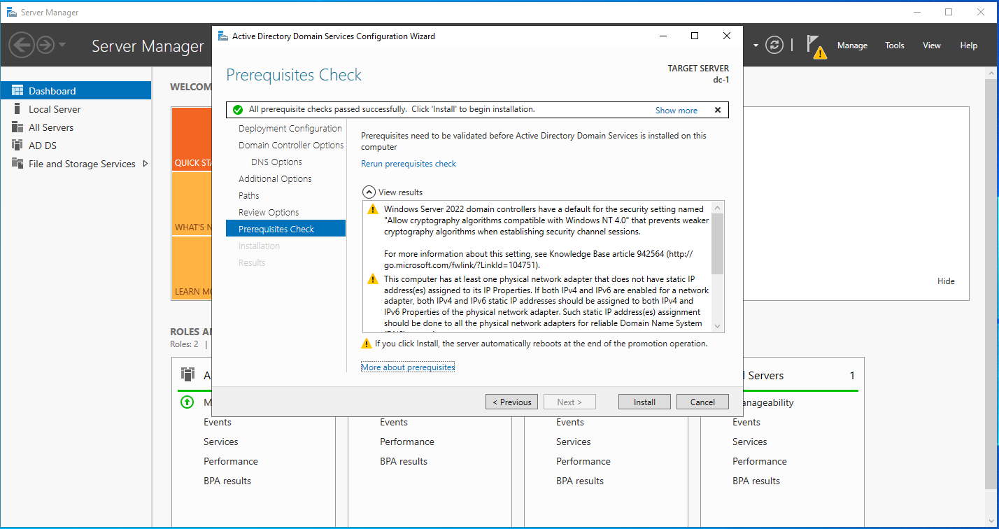

#### Organizational Unit Configuration

Using Active Directory Users and Computers (ADUC), I created Organizational Units to organize accounts based on their purpose:

- `_EMPLOYEES` — standard domain user accounts
- `_ADMINS` — privileged administrator accounts

Organizational Units provide a structured way to manage users and allow policies and permissions to be applied to specific groups of objects.

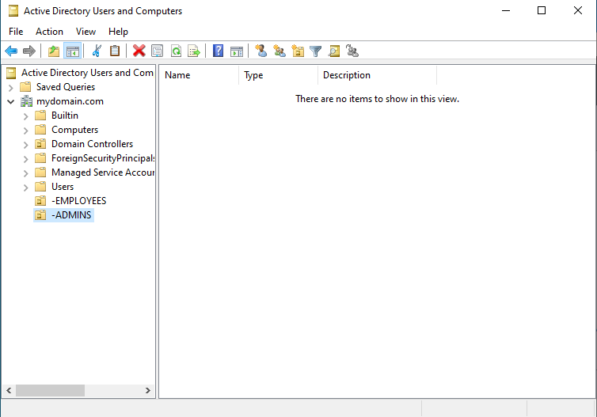

#### Domain Administrator Account

I created a dedicated administrative user inside the `_ADMINS` Organizational Unit and added the account to the **Domain Admins** security group.

I then used the domain administrator account for subsequent domain-level administrative tasks instead of relying on the original local administrator account.

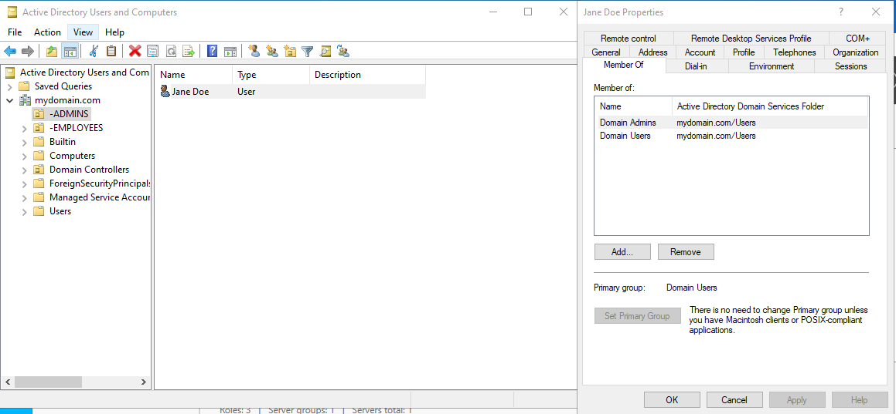

#### Joining Client-1 to the Domain

After Active Directory was configured, I joined Client-1 to `mydomain.com`.

From Client-1, I opened System Properties, changed the computer's membership from a workgroup to the domain, and authenticated using domain administrator credentials.

After restarting Client-1, I successfully logged into the computer using a domain account, confirming that:

- Client-1 could locate DC-1 through DNS
- Domain authentication was functioning
- Client-1 was successfully joined to Active Directory
- The Domain Controller could centrally manage the client computer

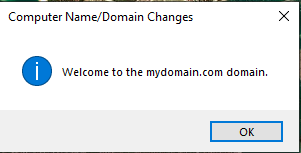

### 3. User & Organizational Unit Management
After deploying Active Directory, I organized domain users and administrative accounts using Organizational Units (OUs) in Active Directory Users and Computers (ADUC).

#### Organizational Unit Structure

I created separate Organizational Units to organize accounts based on their roles:

* **_EMPLOYEES** — standard domain user accounts
* **_ADMINS** — privileged administrative accounts

Separating standard users from administrative accounts provides a cleaner directory structure and makes it easier to apply different policies, permissions, and administrative controls.

#### User Account Management

I created user accounts within Active Directory and placed them into the appropriate Organizational Units based on their intended roles.

For administrative tasks, I created a dedicated administrator account inside the **_ADMINS** OU and added the account to the **Domain Admins** security group.

This allowed administrative privileges to be assigned through group membership rather than relying on the original local administrator account.

#### Skills Demonstrated

* Active Directory Users and Computers (ADUC)
* Organizational Unit (OU) management
* User account creation and administration
* Security group membership
* Role-based account organization
* Domain administrator configuration

### 4. Remote Desktop Configuration
After joining Client-1 to the Active Directory domain, I configured Remote Desktop access to allow authorized domain users to remotely access the client computer.

#### Client Environment

Client-1 was configured as a Windows 10 Pro workstation and joined to the `mydomain.com` Active Directory domain.

The domain-joined configuration allows users to authenticate using centrally managed Active Directory accounts rather than relying only on local user accounts.

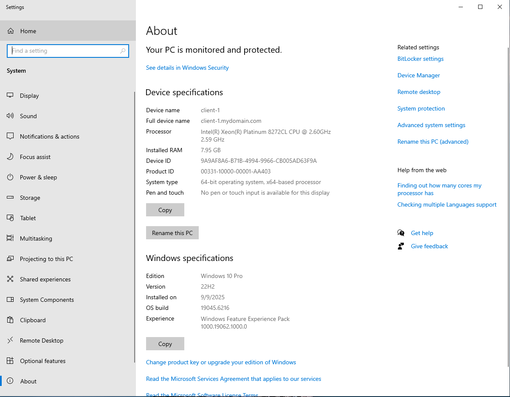

#### Remote Desktop Access

I enabled Remote Desktop on Client-1 and configured remote access for domain users.

Rather than granting unnecessary administrative privileges, standard domain accounts could be authorized for Remote Desktop access while remaining non-administrative users.

This demonstrates how Active Directory can be used alongside Remote Desktop to provide controlled remote access to domain-joined workstations.

#### Domain User Management

Domain users were managed centrally through Active Directory Users and Computers (ADUC). These accounts could then be assigned appropriate access based on their role and administrative requirements.

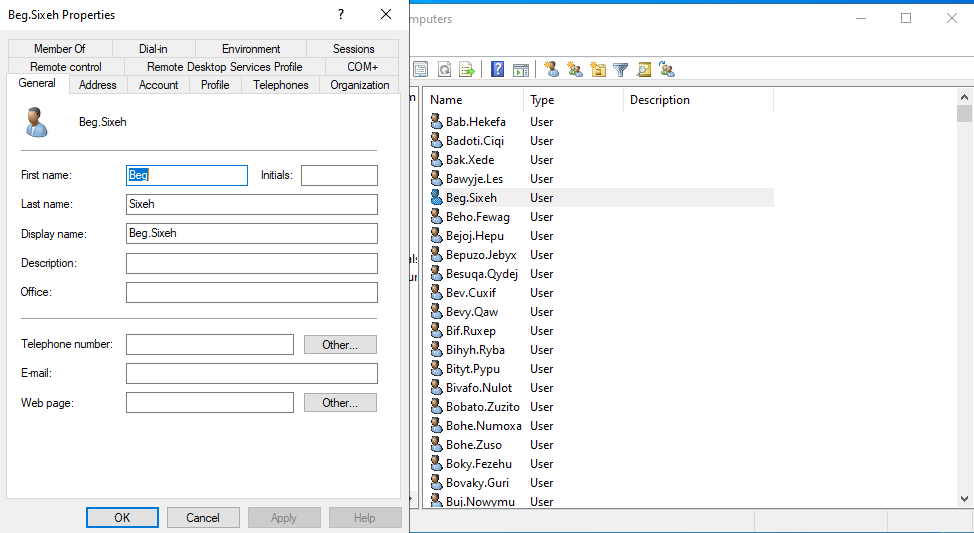

#### Skills Demonstrated

* Remote Desktop Protocol (RDP)
* Windows Remote Desktop configuration
* Domain user authentication
* Remote access permissions
* Active Directory user management
* Domain-joined workstation administration

### 5. Group Policy & Account Lockout
### 5. Group Policy & Account Lockout

After configuring Active Directory, I used Group Policy to implement and enforce an account lockout policy across the domain. This provides centralized security management and helps protect domain accounts against repeated failed authentication attempts.

#### Group Policy Management

Using Group Policy Management on DC-1, I edited the **Default Domain Policy** for the `mydomain.com` domain.

The account lockout settings were configured through:

**Computer Configuration → Policies → Windows Settings → Security Settings → Account Policies → Account Lockout Policy**

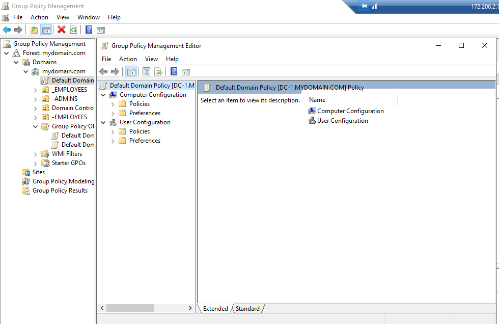

#### Account Lockout Policy Configuration

I configured the following account lockout settings:

* **Account lockout duration:** 30 minutes
* **Account lockout threshold:** 3 invalid logon attempts
* **Allow Administrator account lockout:** Enabled
* **Reset account lockout counter after:** 15 minutes

These settings help reduce the risk of repeated password-guessing attempts by temporarily locking accounts after multiple failed logins.

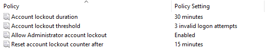

#### Applying Group Policy

After configuring the policy on the Domain Controller, I updated Group Policy on the domain-joined Client-1 workstation using:

`gpupdate /force`

Both the Computer Policy and User Policy updates completed successfully.

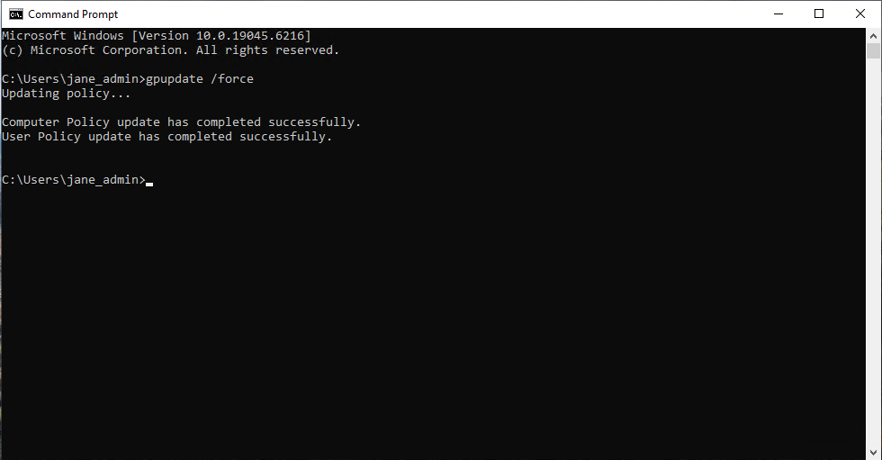

#### Policy Verification

To verify that the account lockout policy was successfully applied to Client-1, I used **Resultant Set of Policy (RSoP)**.

RSoP confirmed that Client-1 received the configured settings from the Default Domain Policy:

* 30-minute account lockout duration
* 3 invalid logon attempts before lockout
* Administrator account lockout enabled
* 15-minute lockout counter reset

This confirmed that Group Policy was being centrally applied from the Active Directory domain to the client workstation.

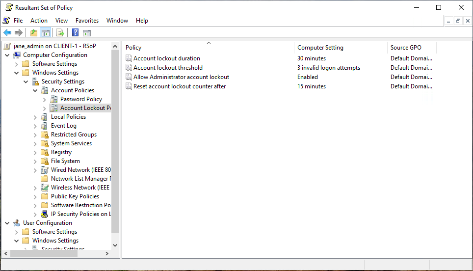

#### Skills Demonstrated

* Group Policy Management (GPMC)
* Group Policy Object (GPO) configuration
* Active Directory security policy administration
* Account lockout policy configuration
* Domain security management
* `gpupdate /force`
* Resultant Set of Policy (RSoP)
* Group Policy troubleshooting and verification

### 6. File Shares & Permissions
## 6. File Shares & Permissions

After configuring Active Directory and Group Policy, I created and managed network file shares to practice centralized file access and permission management in a Windows domain environment.

#### Network File Share Configuration

On DC-1, I configured multiple shared folders with different levels of access:

* **Share_Read** — read-only access for authorized domain users
* **Share_Write** — read and write access for authorized domain users
* **Admins_Only** — restricted access for administrative users

This configuration demonstrates how network resources can be centrally hosted while controlling what users are allowed to access and modify.

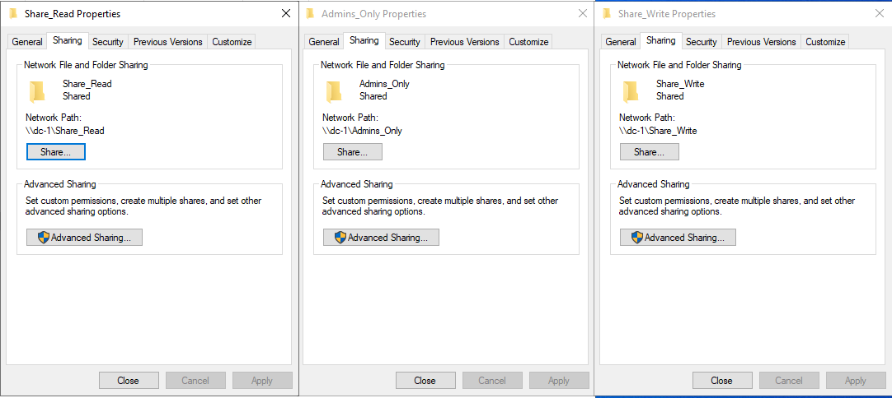

#### Share Permission Testing

From Client-1, I accessed the shared folders over the network and tested the permissions assigned to the domain user.

The user was able to create files inside **Share_Write**, while attempts to modify content inside **Share_Read** were denied.

This verified that the configured permissions were correctly restricting user actions based on the intended access level.

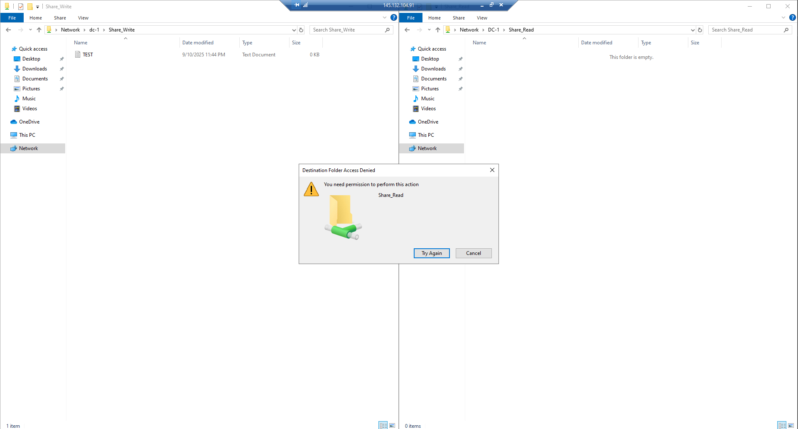

#### Security Group-Based Access

I also configured a restricted **Finance** network share to demonstrate role-based access using Active Directory security groups.

Initially, the domain user did not have permission to access the Finance share.

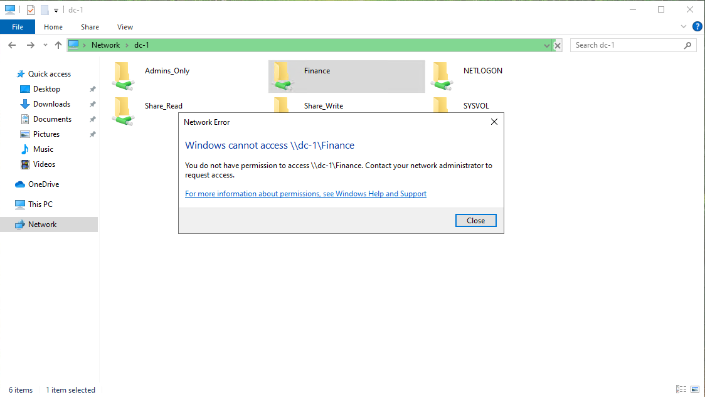

Access was then granted through membership in the **Finance_Team** security group. After the appropriate permissions were applied, the user was able to access the Finance share and its contents.

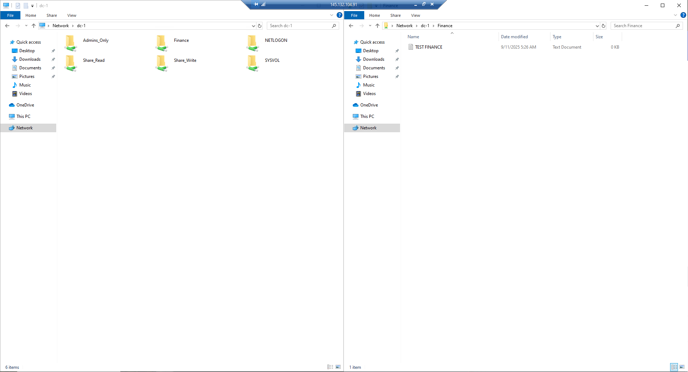

This demonstrates how Active Directory security groups can be used to manage access to organizational resources without assigning permissions individually to every user.

#### Skills Demonstrated

* Windows network file sharing
* Share and NTFS permission management
* Active Directory security groups
* Role-based access control
* Network resource administration
* Permission troubleshooting and verification
* Principle of least privilege
* Windows Server file share administration

---

## 💡 Skills Demonstrated

- Active Directory Administration
- Windows Server Administration
- User and Group Management
- Group Policy
- DNS
- PowerShell
- Remote Desktop
- File and Share Permissions
- Identity and Access Management
- IT Troubleshooting

---

## 📖 What I Learned

This project gave me practical experience working with a Windows domain environment and helped me understand how centralized identity, authentication, permissions, and policies are managed in an enterprise network.

I also gained experience troubleshooting user accounts, managing access to resources, and performing administrative tasks commonly encountered in IT Support and System Administration environments.
